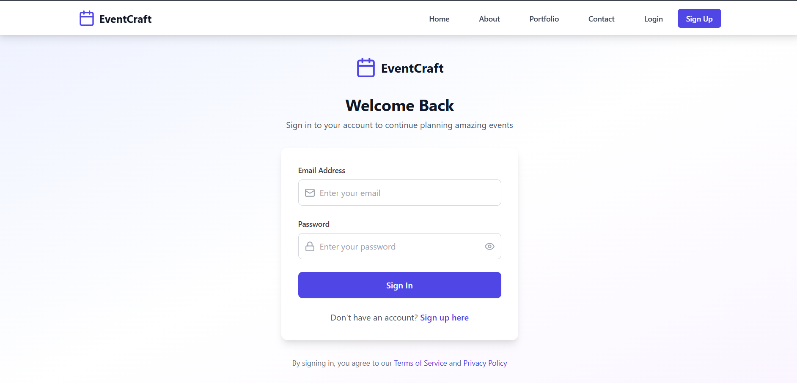

# EventCraft

A modern event management website built with React, Vite, and Firebase.  
Easily manage events, showcase your portfolio, and collect client testimonials.

## Features

- Responsive, modern UI with Tailwind CSS
- User authentication (login/signup)
- Event portfolio with categories
- Contact form
- Client testimonials
- Admin and client roles (via Firebase)
- Firestore integration for dynamic data

## Getting Started

### Prerequisites

- Node.js (v16+ recommended)
- npm

### Installation

```bash
git clone https://github.com/your-username/eventcraft.git
cd eventcraft
npm install
```

### Running the App

```bash
npm run dev
```

The app will be available at [http://localhost:5173](http://localhost:5173) (or as shown in your terminal).

---

## Firebase Setup

1. Create a Firebase project at [Firebase Console](https://console.firebase.google.com/).
2. Enable Authentication and Firestore (see `FIRESTORE_SETUP.md` for detailed steps and schema).
3. Copy your Firebase config into `src/firebase/config.js`:

```js
const firebaseConfig = {
  apiKey: "your-api-key",
  authDomain: "your-project-id.firebaseapp.com",
  projectId: "your-project-id",
  storageBucket: "your-project-id.appspot.com",
  messagingSenderId: "your-messaging-sender-id",
  appId: "your-app-id"
};
```

---

## Screenshots

Create a `screenshots/` folder in your project root and add your images there.

Example:

```markdown
## Home Page


## Portfolio


## Login



## Sign up


```

---

## Folder Structure

```
src/
  components/    # Reusable UI components
  context/       # React context providers
  firebase/      # Firebase config
  pages/         # Page components (Home, About, Portfolio, etc.)
  App.jsx        # Main app with routing
  main.tsx       # Entry point
```

---

## License

MIT
